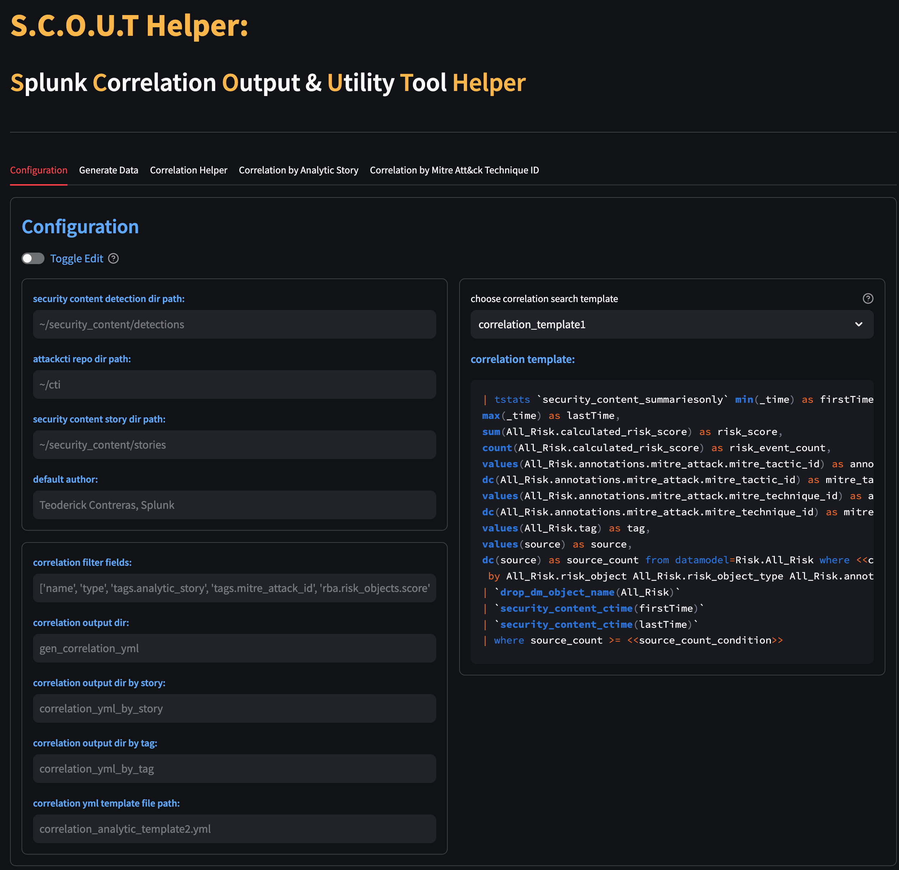
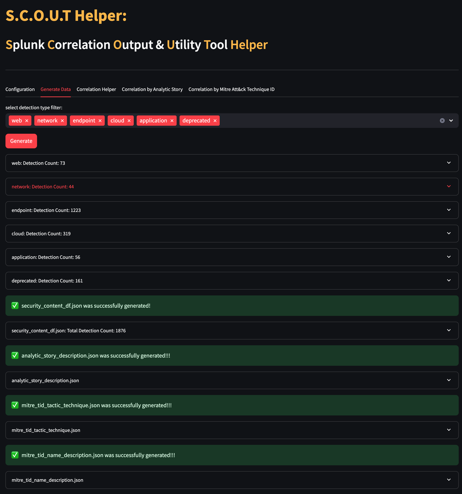
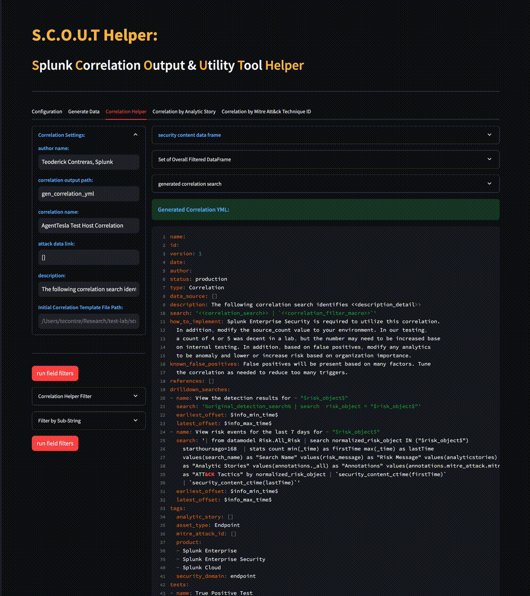

# SCOUT


## Description
This lightweight Streamlit-based utility simplifies the creation of Splunk correlation searches by leveraging Splunk Security Content metadata. It allows users to generate correlation rules efficiently by filtering based on key Splunk Security Content fields, including:

- **Analytic Story**  
- **Detection Name**  
- **MITRE ATT&CK Technique ID**  

Designed for ease of use, this tool streamlines threat detection and enhances security operations by providing quick and structured correlation search generation.


## Get Started


### MAC/LINUX
1. clone the Splunk Security Content github repo. We recommend to follow this steps [Security Content Getting Started](https://github.com/splunk/security_content).
2. Clone the ATT&CK CTI repository ([mitre/cti](https://github.com/mitre/cti)).
This step ensures that SCOUT can still retrieve the necessary MITRE ATT&CK information for generating correlation searches, even if there are timeouts when accessing ATT&CK CTI through its library.
3. Install Poetry (if not already installed)
```
curl -sSL https://install.python-poetry.org/ | python3 -
```
4. Navigate to your project directory
```
cd /path/to/your/project
```
5. Create a virtual environment and activate it
```
poetry shell
```
6. Install project dependencies
```
poetry install
```
7. Then run the streamlit main page
```
streamlit run scout-helper.py
```

### Windows
We recommend using the Windows Subsystem for Linux (WSL). You can find a tutorial [here](https://learn.microsoft.com/en-us/windows/wsl/install). After installing WSL, you can follow the steps described in the Linux section.


## Setup
The following steps outline the essential configuration required to ensure proper functionality.

### Configuration

In the Configuration tab, the user must specify three key folder paths where this tool parses metadata to generate correlation searches:
| Fields                                        | Description
|-----------------------------------------------|-----------------------------------------------------------------------|
| **Security Content Detection Dir Path**       | The folder path containing Splunk Security Content detections.        |
| **ATT&CK CTI Repo Dir Path**                  | The folder path where the cloned attackcti repository is located.     |
| **Security Content Story Dir Path**           | The folder path containing Splunk Security Content Analytic Stories.  |
| **Default Author**                            | The default author name for correlation searches.                     |
  
All other fields can be left as they are.





### Data Frame Generation

This lightweight utility tool parses selected or all Splunk detections from the Security Content Detection folder. Thousands of YAML files are processed and converted into a structured DataFrame, enabling efficient parsing, filtering, and data visualization.

Figure below, illustrates how this tool allows users to select specific detections to focus on. In this example, all detections are chosen.





### Short DEMO

Below is a brief demo showcasing how the SCOUT utility tool can be used to generate a correlation search. This search can then be enhanced, modified, and tested to suit the specific needs of your production environment.


